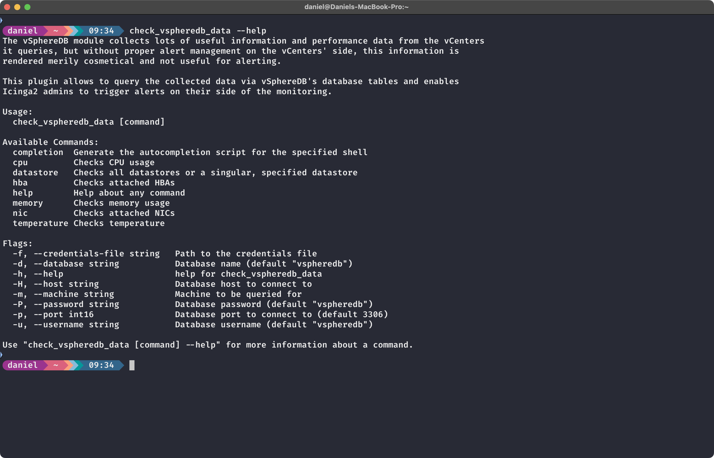

# README

`check_vspheredb_data` is a check plugin for checking performance data gathered by the [Icingaweb2 vSphereDB module](https://github.com/icinga/icingaweb2-module-vspheredb)
against given thresholds written in Go. It is a rewrite of [an older version](https://github.com/NETWAYS/vspheredb-data-check) written in Rust, utilizing the [go-check](https://github.com/NETWAYS/go-check) SDK for monitoring plugins for better maintainability.

It allows for finegrained monitoring of ESXI hosts on Icinga2's side without the need to configure alerting on
the vCenters' side as vSphereDB's inbuilt mechanisms do.



## Installation

Download a Release binary for your system's architecture from the [Releases](https://github.com/NETWAYS/check_vspheredb_data/releases) page.

## Building the project

Alternatively, you can build the binary yourself using the Golang toolchain.

```shell
git clone https://github.com/NETWAYS/check_vspheredb_data --branch=v1.0.0
cd check_vspheredb_data
go mod tidy
go build .
```

The resulting binary `check_vspheredb_data` can be found in the root directory of the repository.

## Usage

The check plugin provides detailed information about available check modes (see thumbnail above). More information can be accessed by
entering `check_vspheredb_data <mode> --help`.

## License

Copyright© 2024 [NETWAYS GmbH](mailto:info@netways.de)

This check plugin is distributed under the GPL-2.0 or newer license shipped with this repository in the [LICENSE](LICENSE) file.
